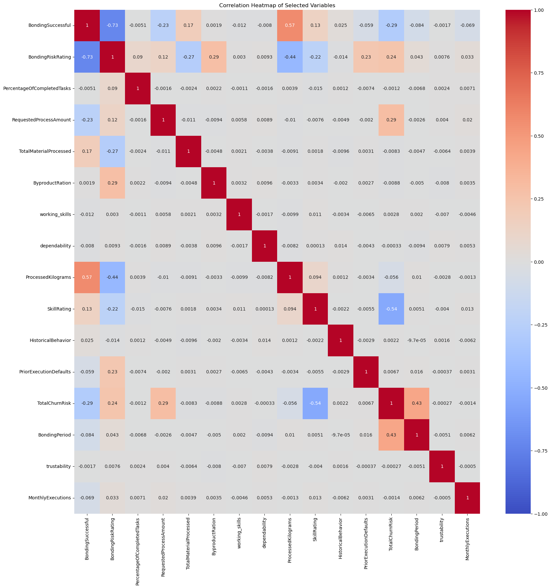
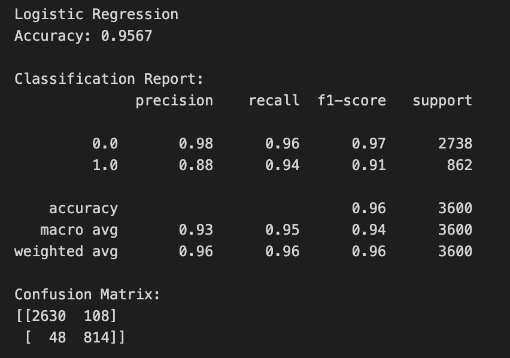
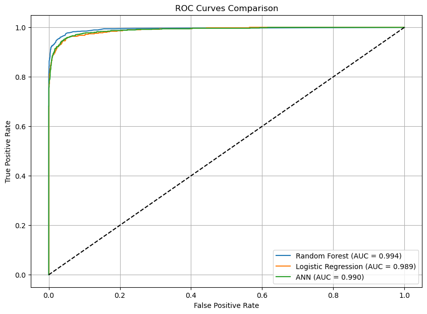

# Title and Team members
Project Title: Aerogel Bonding
Team Members: 
- Assima Amangeldina
- Ceyla Kaya

# [Section 1] Introduction
This project focuses on predicting whether aerogel bonding processes are successful using the dataset aerogel_bonding.csv. The goal is to assist Advanced Material Corporate Ltd in evaluating bonding quality for commercial use.

The dataset contains over 30 features describing:

- Worker characteristics (skills, experience, dependability, mistakes, churn risk)

- Process metrics (processed material amounts, bonding duration, byproduct ratios)

- Operational data (task execution, work history, material processing)

The target variable "BondingSuccessful" indicates whether a bonding operation was commercially acceptable (1) or unsuccessful (0).

# [Section 2] Methods
## 2.0 Environment Setup

To ensure full reproducibility of our results, we created a dedicated Conda environment named "aerogel_env" for this project.
After installing all necessary libraries (pandas, numpy, scikit-learn, seaborn, matplotlib, missingno, etc.), we exported the environment using:

`conda env export > environment.yml`

This file is included in the repository so that anyone can recreate the exact same environment.

To recreate our environment:

`conda env create -f environment.yml`
`conda activate aerogel_env` 

This guarantees identical package versions, consistent model behavior, reproducible experiments and no dependency conflicts on different machines

Our workflow consists of four main stages: data preprocessing, feature selection, model training, and evaluation.

## 2.1 Data Preprocessing

**Dataset Inspection**

We began by loading the dataset and examining variable types, ranges, and initial distributions. This step ensures that numerical, categorical, and binary variables are correctly identified before applying transformations.

Missing Values Analysis using:

`df.isna().sum()` 
`missingno.matrix()`
`missingno.bar()`

We identified that most columns contained a small and consistent proportion of missing values (~9–10%). Since no column had excessive missingness and the dataset is large (20,000+ samples), we decided not to drop rows or columns, preserving data variety and statistical power.

**Missing Values Handling**

We used a type-dependent imputation strategy:

*Numeric features* → mean imputation
Reason: preserves distribution and avoids biasing towards frequent values.

*Categorical and binary features* → mode imputation
Reason: selecting the most frequent category maintains interpretability and avoids introducing artificial values.

This ensures that no missingness remains while keeping the statistical properties intact.

## 2.2 Feature Selection

**Correlation Analysis**

We computed a correlation matrix and plotted a heatmap to identify features most strongly associated with the target variable BondingSuccessful. Strong positive or negative correlations suggest predictive usefulness.
Below we include the heatmap generated in our notebook:

**Pairplot Exploration**

We used a seaborn pairplot to visually inspect:

- feature relationships
- class separation
- linear vs. nonlinear dependencies

**Selected Features**
Based on these analyses, we selected six features with the strongest predictive potential:

- ProcessedKilograms (high positive correlation coefficient 0.53)
- BondingRiskRating (high negative correlation coefficient -0.68)
- TotalChurnRisk (moderate negative correlation coefficient -0.27)
- RequestedProcessAmount (low negative correlation coefficient of -0.21)
- SkillRating (low positive correlation coefficient 0.13 we keep this one for comparison purposes)
- BondingPeriod (very low negative correlation of -0.097)

These variables directly relate to bonding quality and operational performance, making them logical and statistically justified predictors.

## 2.3 Train/Test Split
We used an 80/20 stratified split, where the target variable proportion is preserved across train and test sets. This choice ensures:

- unbiased generalization assessment
- stable class ratios (important because class 1 is less frequent)
- avoidance of model skew toward majority class

Stratification prevents the risk of a test set lacking minority class samples, which would invalidate evaluation metrics.
This also serves as the foundation for model comparison, ensuring all models train under identical data conditions.

## 2.4 Feature Scaling
We applied MinMaxScaler to the selected numerical features. Scaling was fitted on the training set only and applied to the test set later, avoiding data leakage.
Scaling is necessary because:

- Logistic Regression relies on gradient descent and is sensitive to feature magnitude.

- Artificial Neural Networks require normalized input to stabilize learning and avoid exploding gradients.

- Random Forest does not require scaling, but we kept the processes consistent for LR and ANN.

All scaled values fall between 0 and 1, improving convergence speed and model stability.

# [Section 3] Experimental Design
To evaluate the predictive performance of different machine learning approaches for aerogel bonding success, we conducted a set of controlled experiments using the cleaned and preprocessed dataset.

## Experiment Purpose
The primary purpose of the experiments was to compare multiple classification algorithms and determine which model most accurately predicts BondingSuccessful, while maintaining good performance on the minority class and ensuring generalization to unseen data.

**Baselines**
To establish a fair and meaningful comparison, we selected two baseline models:

***Logistic Regression (Baseline 1)***
- A simple, interpretable linear classifier
- Helps establish minimum expected performance
- Acts as a benchmark for more complex nonlinear models

***Random Forest (Baseline 2)***
- A robust ensemble method well‐suited for tabular datasets
- Captures nonlinear relationships
- Provides feature importance for interpretability
- Serves as a strong real-world baseline

***Artificial Neural Network (MLPClassifier)—Main Experiment***
- This model tests whether a deep-learning approach:
- outperforms classical ML models,
- captures nonlinear and interaction effects between features,
- generalizes well without overfitting.

## Experimental Procedure
All models follow the same controlled pipeline:

- The same 6 selected features
- The same 80/20 stratified train–test split
- Scaling applied only to LR and ANN using MinMaxScaler
- No data leakage (scaler fit only on training data)
- Predictions evaluated on the untouched test split

This ensures that differences in performance arise from the model itself, not from inconsistent preprocessing.

## Evaluation Metrics
Because the target is moderately imbalanced (~24% positive class), we selected metrics that correctly reflect performance for both classes.

**Classification Metrics**

- Accuracy – overall correctness

- Precision – reliability of predicted successes

- Recall – ability to detect true successful bonding cases

- F1-score – harmonic mean of precision and recall; best for imbalance

- Confusion Matrix – reveals specific misclassification patterns

**Ranking Metrics**

- ROC Curve + AUC – evaluates model ability to rank positive samples

- Precision–Recall Curve + Average Precision – better for imbalanced data

Using both ROC-AUC and PR-AUC allows us to assess: performance across thresholds and behavior on minority class detection, overall ranking quality of probability outputs.

# [Section 4] Results
After training all three models (Logistic Regression, Random Forest, and Artificial Neural Network) on the same stratified training set and evaluating them on the same test set, we obtained the following results.

## 4.1 Main Findings**

Random Forest achieved the highest performance across all metrics, with an accuracy of 0.975 and an F1-score of 0.97.

ANN (MLPClassifier) ranked closely behind RF, reaching an accuracy of 0.9658 and similarly strong precision and recall on both classes.

Logistic Regression performed very well for a linear model, achieving 0.9567 accuracy, though it struggled slightly with class 1 precision compared to ANN and RF.

These results show that nonlinear methods (especially Random Forest and ANN) are better suited to capturing the complex relationships between features in the aerogel bonding dataset.

## 4.3 ROC Curve Comparison
All models achieved extremely high AUC scores:

Random Forest: AUC = 0.994

Logistic Regression: AUC = 0.989

ANN (MLPClassifier): AUC = 0.990

The ROC curves reveal that all three models have excellent ranking ability, with Random Forest performing slightly better.

## 4.4 Precision–Recall Curve Comparison

Because the dataset has a moderately imbalanced target variable (~24% positive class), we also evaluated the models using PR curves:

Random Forest: Highest average precision (AP), indicating superior recall–precision tradeoff

ANN: Slightly lower than RF but still strong

Logistic Regression: Baseline performance but competitive

These curves confirm that all models maintain high performance even when focusing on the minority class.

# [Section 5] Conclusions 

## 5.1 Key Takeaways

Through systematic preprocessing, feature selection, and controlled model evaluation, we demonstrate that machine learning can accurately predict aerogel bonding success.
Across all models, Random Forest provides the most robust results, achieving:

- the highest accuracy,

- the strongest F1-score,

- the best ROC-AUC and Precision–Recall performance.

This suggests that the aerogel bonding process is governed by nonlinear interactions between worker performance metrics and process variables—relationships that ensemble and neural models capture better than linear methods.

## 5.2 Limitations and Future Work

Although our results are strong, several questions remain open:

Feature engineering could be expanded (interaction terms, temporal features from timestamps, or domain-specific transformations).

Model interpretability can be further improved using SHAP or LIME to understand how each feature contributes to successful bonding.

Hyperparameter tuning (especially for ANN and RF) could potentially further improve performance.

External validation on new or unseen industrial samples would test generalizability in real production settings.

Deployment (API or embedded device) could be explored for real-time bonding quality prediction.

Future work could focus on these directions to build a fully production-ready aerogel bonding prediction system.